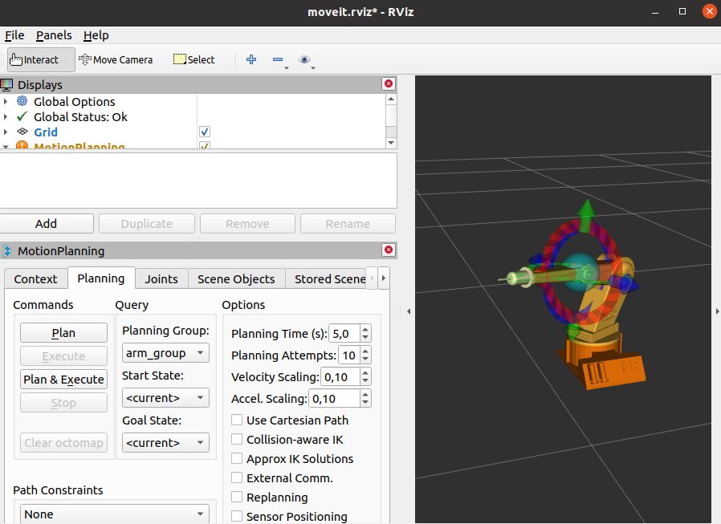

# 🦾 4R-Manipulator-Arm

The **4R robotic manipulator arm** is a mechanical system with four rotational joints (4 Degrees of Freedom) designed for performing precise positioning and manipulation tasks. This project focuses on the **design, modeling, simulation, and control** of the manipulator using **SolidWorks**, **MATLAB/Simulink**, and **ROS**. It serves as a comprehensive platform for learning about robotics, kinematics, dynamics, and control systems.


---

## 📁 Project Structure

```
4R-Manipulator-Arm/
├── CAD/                          # SolidWorks files (parts, assembly, drawings)
├── MATLAB/                       # Kinematic and dynamic models
│   ├── ForwardKinematics.m
│   ├── InverseKinematics.m
│   ├── Dynamics.m
│   └── Simulink/                 # Simulink models for simulation
├── ROS/                          # ROS packages and launch files
│   ├── robot_arm_urdf/           # URDF exported from SolidWorks
│   ├── moveit_robot_arm_sim/     # MoveIt configuration
│   └── launch/                   # Launch files for Gazebo and Rviz
├── Docs/                         # Project report and documentation
└── README.md
```

---

## ✨ Features

### 🛠️ Mechanical Design
- 4 rotational joints (shoulder, elbow, wrist)
- Modular design in **SolidWorks**
- Lightweight structure for educational and research use

### 📐 Kinematic Modeling
- **Forward kinematics** using Denavit–Hartenberg (D-H) parameters
- **Inverse kinematics** for joint angle calculation from end-effector position
- Workspace analysis and visualization in MATLAB

### ⚙️ Dynamic Modeling
- Equations of motion derived using **Lagrange’s method**
- Torque simulation for each joint
- Energy and force analysis

### 🧪 Simulation & Control
- **MATLAB/Simulink** for kinematic and dynamic simulation
- **Simscape Multibody** for 3D visualization
- **ROS** integration for Gazebo simulation and MoveIt motion planning
- Custom GUI for interactive control

---

## 🧮 Kinematic Parameters (D-H Table)

| Joint | \(a_i\) (mm) | \(\alpha_i\) (°) | \(d_i\) (mm) | \(\theta_i\) |
|-------|--------------|------------------|--------------|-------------|
| 1     | 50           | -90              | 145          | \(\theta_1\) |
| 2     | 90           | 0                | 0            | \(\theta_2\) |
| 3     | 108          | 0                | 0            | \(\theta_3\) |
| 4     | 62.5         | 0                | 0            | \(\theta_4\) |

---

## 🚀 How to Use

### 1. MATLAB/Simulink Simulation
```matlab
% Run workspace simulation
run('MATLAB/WorkspaceSimulation.m');

% Open Simulink model
open_system('MATLAB/Simulink/RobotArm_Model.slx');
```

### 2. ROS Simulation (Ubuntu 20.04 + ROS Noetic)
```bash
# Clone the repository
git clone https://github.com/your-username/4R-Manipulator-Arm.git
cd 4R-Manipulator-Arm/ROS

# Build the workspace
catkin_make

# Launch in Gazebo
roslaunch robot_arm_urdf gazebo.launch

# Launch with MoveIt
roslaunch moveit_robot_arm_sim demo.launch
```

### 3. SolidWorks Models
- Open `CAD/Assembly.SLDASM` to view the full robot assembly.
- Export URDF using the **Simscape Multibody Link** plugin.

---

## 📊 Results
### Robot Simulation in MATLAB


### ROS/MoveIt Simulation


---

## 📚 Applications

- **Educational Robotics**: Teaching kinematics, dynamics, and control
- **Industrial Training**: Foundation for manufacturing and automation robots
- **Research Platform**: Extendable to 6-DOF, AI control, or ROS integration

---

## 📄 Documentation

- [Final Report](Docs/Version%20finale%20Rapport%20Robotique.pdf)
- [ROS Setup Guide](Docs/ros.pdf)

---

## 👥 Authors

- **LABLIGHI Ahmed**
- **EL HADAOUI Abdelilah**

Supervised by: **Pr. Zekraoui Mustapha**

---

## 📜 License

This project is licensed under the MIT License. See `LICENSE` for details.

---

## 🤝 Contributing

Contributions are welcome! Please open an issue or submit a pull request.

---

## 🌟 Acknowledgments

- Faculty of Sciences and Techniques Beni Mellal
- Department of Mechanical Engineering
- Productics & Mechatronics Program
